# Configurations

Sanic-OpenAPI provides following configurable items:

* API Server
* API information
* Authentication(Security Definitions)
* URI filter
* Swagger UI configurations

## API Server

By default, Swagger will use exactly the same host which served itself as the API server. But you can still override this by setting following configurations. For more information, please check document at [here](https://swagger.io/docs/specification/2-0/api-host-and-base-path/).

### API_HOST

* Key: `API_HOST`
* Type: `str` of IP, or hostname
* Default: `None`
* Usage:

    ```python
    from sanic import Sanic
    from sanic_openapi import openapi2_blueprint

    app = Sanic()
    app.blueprint(openapi2_blueprint)
    app.config["API_HOST"] = "petstore.swagger.io"

    ```

* Result:
  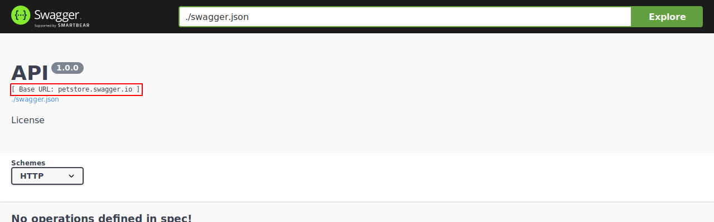

### API_BASEPATH

* Key: `API_BASEPATH`
* Type: `str`
* Default: `None`
* Usage:

    ```python
    from sanic import Sanic
    from sanic_openapi import openapi2_blueprint

    app = Sanic()
    app.blueprint(openapi2_blueprint)
    app.config["API_BASEPATH"] = "/api"

    ```

* Result:
  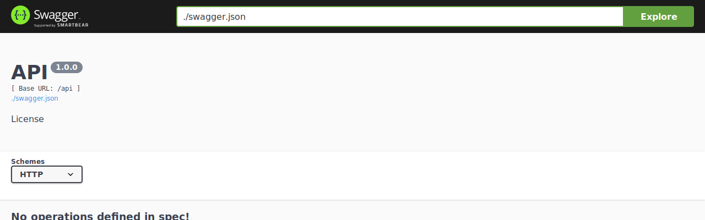

### API_SCHEMES

* Key: `API_SCHEMES`
* Type: `list` of schemes
* Default: `["http"]`
* Usage:

    ```python
    from sanic import Sanic
    from sanic_openapi import openapi2_blueprint

    app = Sanic()
    app.blueprint(openapi2_blueprint)
    app.config["API_SCHEMES"] = ["https"]

    ```

* Result:
  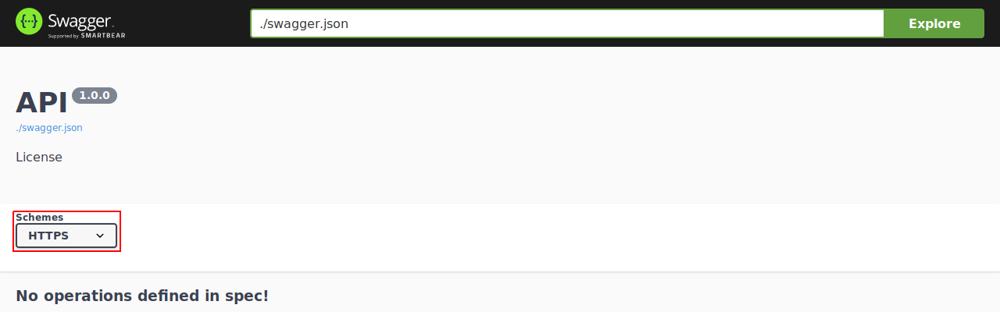

## API information

You can provide some additional information of your APIs by using Sanic-OpenAPI configurations.
For more detail of those additional information, please check the [document](https://swagger.io/specification/#infoObject) from Swagger.

### API_VERSION

* Key: `API_VERSION`
* Type: `str`
* Default: `1.0.0`
* Usage:

    ```python
    from sanic import Sanic
    from sanic_openapi import openapi2_blueprint

    app = Sanic()
    app.blueprint(openapi2_blueprint)
    app.config["API_VERSION"] = "0.1.0"

    ```

* Result:
  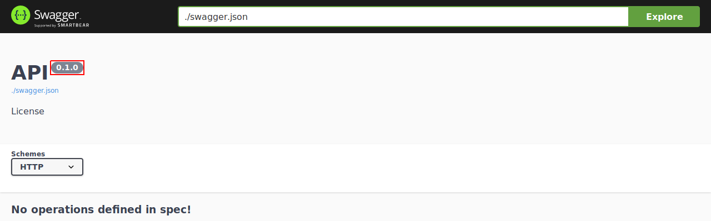

### API_TITLE

* Key: `API_TITLE`
* Type: `str`
* Default: `API`
* Usage:

    ```python
    from sanic import Sanic
    from sanic_openapi import openapi2_blueprint

    app = Sanic()
    app.blueprint(openapi2_blueprint)
    app.config["API_TITLE"] = "Sanic-OpenAPI"

    ```

* Result:
  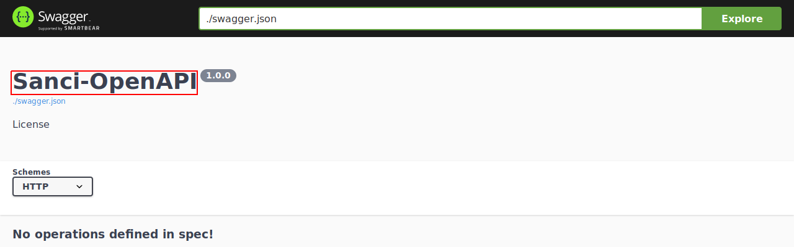

### API_DESCRIPTION

* Key: `API_DESCRIPTION`
* Type: `str`
* Deafult: `""`
* Usage:

    ```python
    from sanic import Sanic
    from sanic_openapi import openapi2_blueprint

    app = Sanic()
    app.blueprint(openapi2_blueprint)
    app.config["API_DESCRIPTION"] = "An example Swagger from Sanic-OpenAPI"

    ```

* Result:
  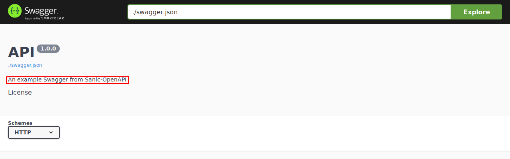

### API_TERMS_OF_SERVICE

* Key: `API_TERMS_OF_SERVICE`
* Type: `str` of a URL
* Deafult: `""`
* Usage:

  ```python
    from sanic import Sanic
    from sanic_openapi import openapi2_blueprint

    app = Sanic()
    app.blueprint(openapi2_blueprint)
    app.config["API_TERMS_OF_SERVICE"] = "https://github.com/sanic-org/sanic-openapi/blob/master/README.md"

  ```

* Result:
  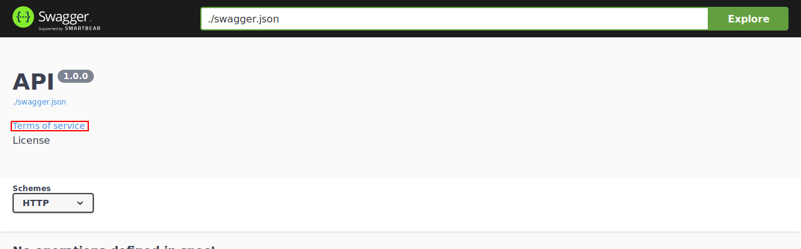

### API_CONTACT_EMAIL

* Key: `API_CONTACT_EMAIL`
* Type: `str` of email address
* Deafult: `None"`
* Usage:

    ```python
    from sanic import Sanic
    from sanic_openapi import openapi2_blueprint

    app = Sanic()
    app.blueprint(openapi2_blueprint)
    app.config["API_CONTACT_EMAIL"] = "foo@bar.com"

    ```

* Result:
  

### API_LICENSE_NAME

* Key: `API_LICENSE_NAME`
* Type: `str`
* Default: `None`
* Usage:

    python
    from sanic import Sanic
    from sanic_openapi import openapi2_blueprint

    app = Sanic()
    app.blueprint(openapi2_blueprint)
    app.config["API_LICENSE_NAME"] = "MIT"

    

* Result:
  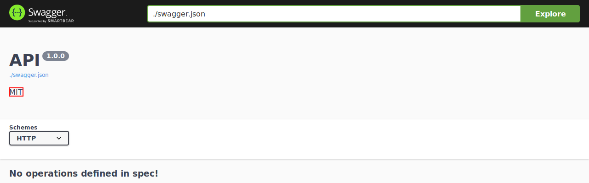

### API_LICENSE_URL

* Key: `API_LICENSE_URL`
* Type: `str` of URL
* Default: `None`
* Usgae:

    ```python
    from sanic import Sanic
    from sanic_openapi import openapi2_blueprint

    app = Sanic()
    app.blueprint(openapi2_blueprint)
    app.config["API_LICENSE_URL"] = "https://github.com/sanic-org/sanic-openapi/blob/master/LICENSE"

    ```

* Result:
  

## Authentication

If your API have to access with authentication, Swagger can provide related configuration as you need. For more information, check [here](https://swagger.io/docs/specification/2-0/authentication/).

### Basic Authentication

* Usage:

    ```python
    from sanic import Sanic
    from sanic.response import json

    from sanic_openapi import openapi2_blueprint

    app = Sanic()
    app.blueprint(openapi2_blueprint)
    app.config["API_SECURITY"] = [{"BasicAuth": []}]
    app.config["API_SECURITY_DEFINITIONS"] = {"BasicAuth": {"type": "basic"}}


    @app.get("/")
    async def test(request):
        return json({"token": request.token})

    ```

* Result:
  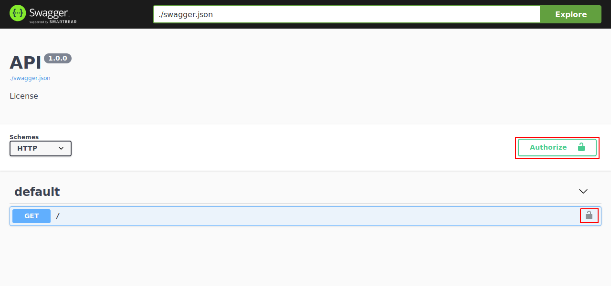
  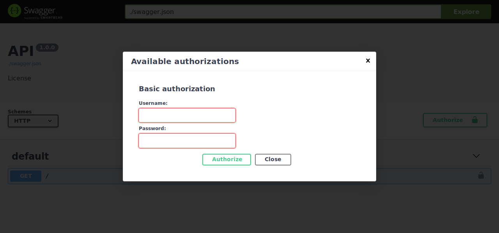

### API Key

#### In Header

* Usage:

    ```python
    from sanic import Sanic
    from sanic.response import json

    from sanic_openapi import openapi2_blueprint

    app = Sanic()
    app.blueprint(openapi2_blueprint)
    app.config["API_SECURITY"] = [{"ApiKeyAuth": []}]
    app.config["API_SECURITY_DEFINITIONS"] = {
        "ApiKeyAuth": {"type": "apiKey", "in": "header", "name": "X-API-KEY"}
    }


    @app.get("/")
    async def test(request):
        api_key = request.headers.get("X-API-KEY")
        return json({"api_key": api_key})

    ```
* Result:
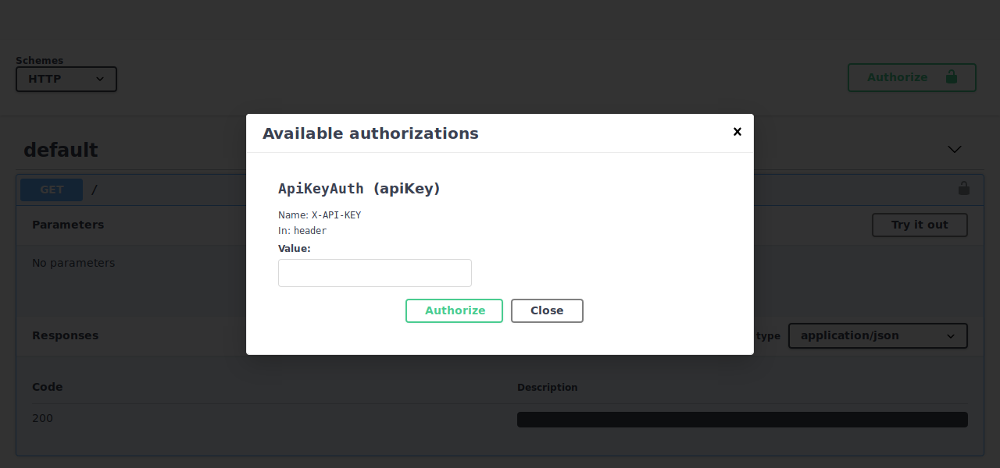

#### In Query

* Usage:

    ```python
    from sanic import Sanic
    from sanic.response import json

    from sanic_openapi import openapi2_blueprint

    app = Sanic()
    app.blueprint(openapi2_blueprint)
    app.config["API_SECURITY"] = [{"ApiKeyAuth": []}]
    app.config["API_SECURITY_DEFINITIONS"] = {
        "ApiKeyAuth": {"type": "apiKey", "in": "query", "name": "api_key"}
    }


    @app.get("/")
    async def test(request):
        api_key = request.args.get("api_key")
        return json({"api_key": api_key})

    ```

* Result:
  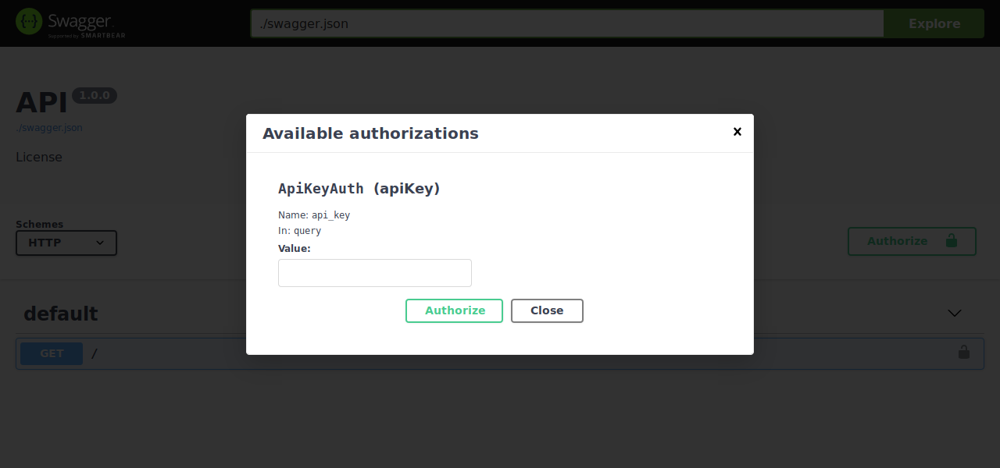

### OAuth2

* Usage:

    ```python
    from sanic import Sanic
    from sanic.response import json

    from sanic_openapi import openapi2_blueprint

    app = Sanic()
    app.blueprint(openapi2_blueprint)
    app.config["API_SECURITY"] = [{"OAuth2": []}]
    app.config["API_SECURITY_DEFINITIONS"] = {
        "OAuth2": {
            "type": "oauth2",
            "flow": "application",
            "tokenUrl": "https://your.authserver.ext/v1/token",
            "scopes": {"some_scope": "Grants access to this API"},
        }
    }

    ```

* Result:
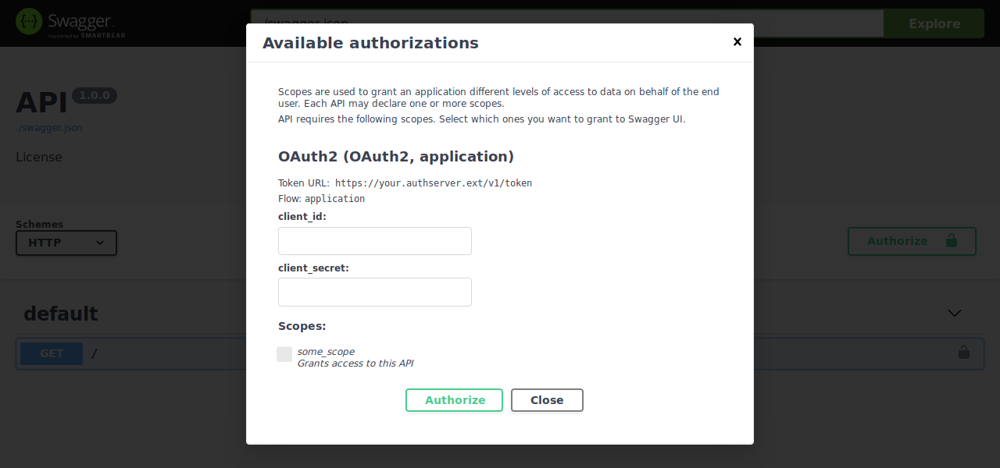

## URI filter

By default, Sanic registers URIs both with and without a trailing `/`. You may specify the type of the shown URIs by setting `app.config.API_URI_FILTER` to one of the following values:

* `all`: Include both types of URIs.
* `slash`: Only include URIs with a trailing `/`.
* All other values (and default): Only include URIs without a trailing `/`.

### Non-Slash

* Usage:

    ```python
    from sanic import Sanic
    from sanic.response import json

    from sanic_openapi import openapi2_blueprint

    app = Sanic()
    app.blueprint(openapi2_blueprint)


    @app.get("/test")
    async def test(request):
        return json({"Hello": "World"})

    ```

* Result:
  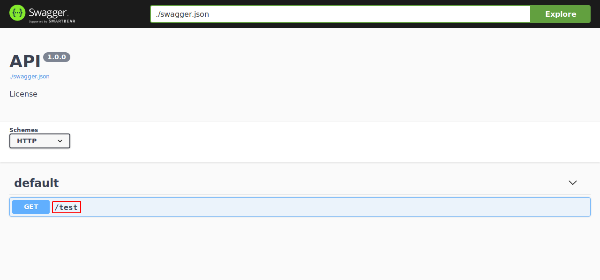

### Slash

* Usage:

    ```python
    from sanic import Sanic
    from sanic.response import json

    from sanic_openapi import openapi2_blueprint

    app = Sanic()
    app.blueprint(openapi2_blueprint)
    app.config["API_URI_FILTER"] = "slash"


    @app.get("/test")
    async def test(request):
        return json({"Hello": "World"})

    ```

* Result:
  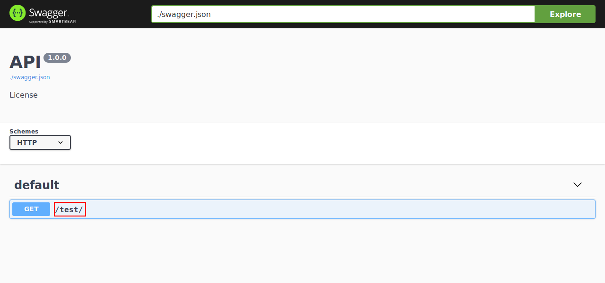

### All

* Usage:

    ```python
    from sanic import Sanic
    from sanic.response import json

    from sanic_openapi import openapi2_blueprint

    app = Sanic()
    app.blueprint(openapi2_blueprint)
    app.config["API_URI_FILTER"] = "all"


    @app.get("/test")
    async def test(request):
        return json({"Hello": "World"})

    ```

* Result:
  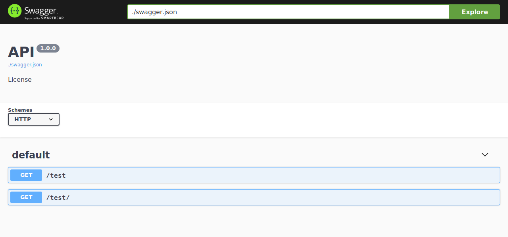

## Swagger UI configurations

Here you can set any configuration described in the Swagger UI [documentation](https://swagger.io/docs/open-source-tools/swagger-ui/usage/configuration/).

```python
app.config.SWAGGER_UI_CONFIGURATION = {
    'validatorUrl': None, # Disable Swagger validator
    'displayRequestDuration': True,
    'docExpansion': 'full'
}
```
