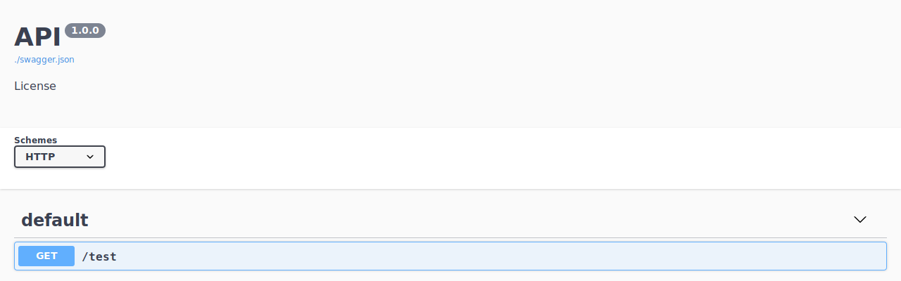
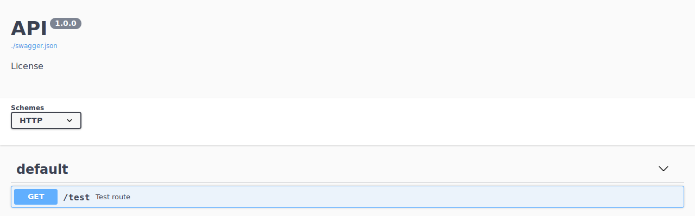
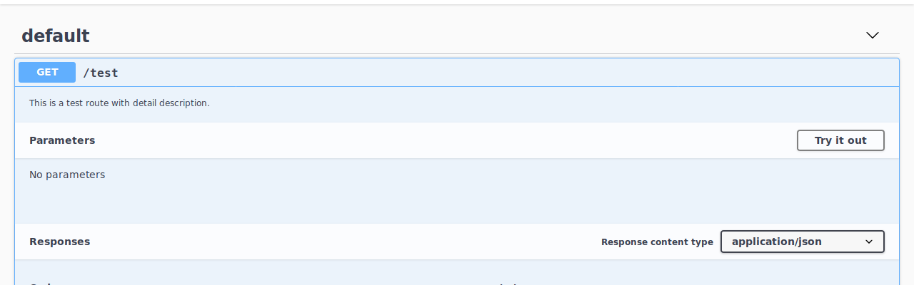
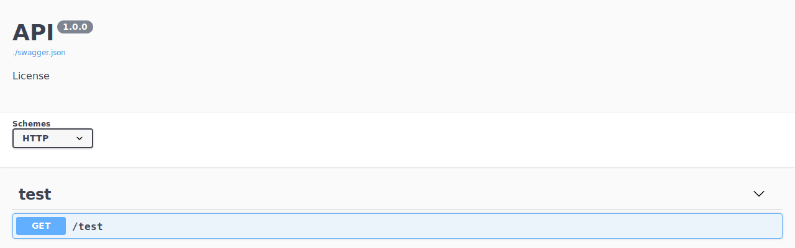
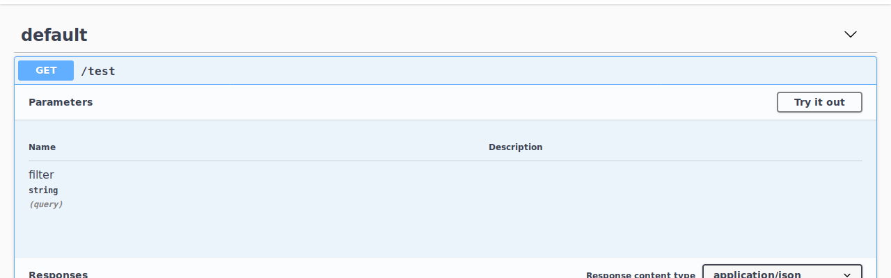
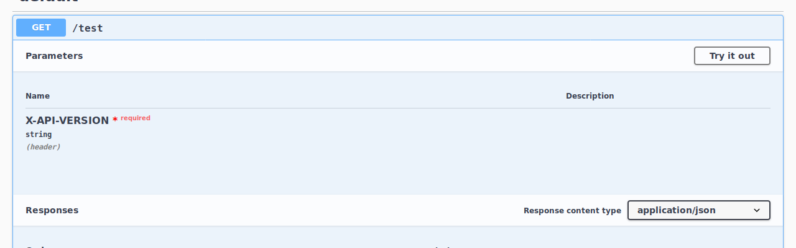
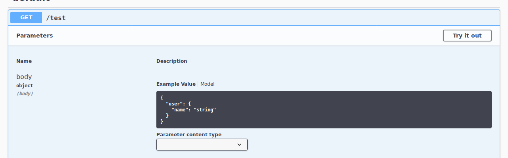
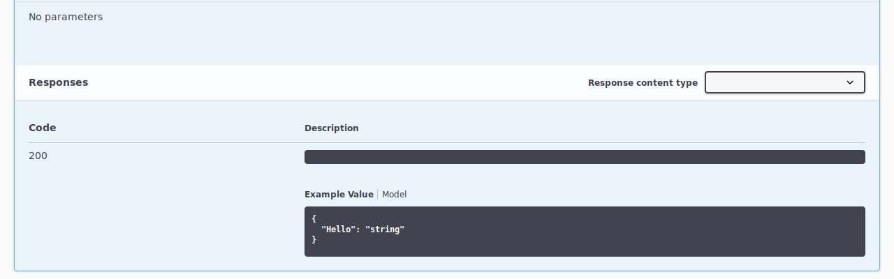
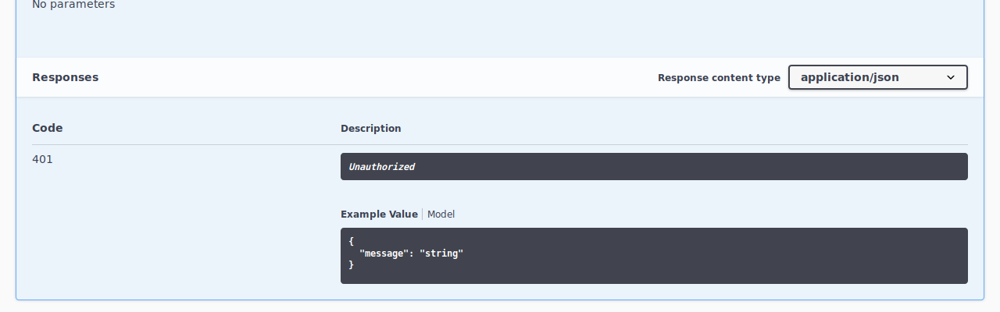

# Decorators

Sanic-OpenAPI provides different **decorator** can help you document your API routes.

## Exclude

When you don't want to document some route in Swagger, you can use `exclude(True)` decorator to exclude route from swagger.

```python
from sanic import Sanic
from sanic.response import json

from sanic_openapi import doc, openapi2_blueprint

app = Sanic()
app.blueprint(openapi2_blueprint)


@app.get("/test")
async def test(request):
    return json({"Hello": "World"})


@app.get("/config")
@doc.exclude(True)
async def get_config(request):
    return json(request.app.config)

```

Once you add the `exclude()` decorator, the route will not be document at swagger.


## Summary

You can add a short summary to your route by using `summary()` decorator. It is helpful to point out the purpose of your API route.

```python
from sanic import Sanic
from sanic.response import json

from sanic_openapi import doc, openapi2_blueprint

app = Sanic()
app.blueprint(openapi2_blueprint)


@app.get("/test")
@doc.summary("Test route")
async def test(request):
    return json({"Hello": "World"})

```

The summary will show behind the path:


## Description

Not only short summary, but also long description of your API route can be addressed by using `description()` decorator.

```python
from sanic import Sanic
from sanic.response import json

from sanic_openapi import doc, openapi2_blueprint

app = Sanic()
app.blueprint(openapi2_blueprint)


@app.get("/test")
@doc.description('This is a test route with detail description.')
async def test(request):
    return json({"Hello": "World"})
```

To see the description, you have to expand the content of route and it would looks like:


## Tag

If you want to group your API routes, you can use `tag()` decorator to accomplish your need.

```python
from sanic import Sanic
from sanic.response import json

from sanic_openapi import doc, openapi2_blueprint

app = Sanic()
app.blueprint(openapi2_blueprint)


@app.get("/test")
@doc.tag("test")
async def test(request):
    return json({"Hello": "World"})

```

And you can see the tag is change from `default` to `test`:


By default, all routes register under Sanic will be tag with `default`. And all routes under Blueprint will be tag with the blueprint name.

## Operation

Sanic-OpenAPI will use route(function) name as the default `operationId`. You can override the `operationId` by using `operation()` decorator. 
The `operation()` decorator would be useful when your routes have duplicate name in some cases.

```python
from sanic import Sanic
from sanic.response import json

from sanic_openapi import doc, openapi2_blueprint

app = Sanic()
app.blueprint(openapi2_blueprint)


@app.get("/test")
@doc.operation('test1')
async def test(request):
    return json({"Hello": "World"})

```

## Consumes

The `consumes()` decorator is the most common used decorator in Sanic-OpenAPI. It is used to document the parameter usages in swagger. You can use built-in classes like `str`, `int`, `dict` or use different [fields](fields.md) which provides by Sanic-OpenAPI to document your parameters.

There are three kinds of parameter usages:

### Query

To document the parameter in query string, you can use `location="query"` in `consumes()` decorator. This is also the default to `consumes()` decorator.

```python
from sanic import Sanic
from sanic.response import json

from sanic_openapi import doc, openapi2_blueprint

app = Sanic()
app.blueprint(openapi2_blueprint)


@app.get("/test")
@doc.consumes(doc.String(name="filter"), location="query")
async def test(request):
    return json({"Hello": "World"})

```

You can expand the contents of route and it will looks like:


When using `consumes()` with `location="query"`, it only support simple types like `str`, `int` but no complex types like `dict`.

### Header

For doucument parameters in header, you can set `location="header"` with simple types just like `location="query"`.

```python
from sanic import Sanic
from sanic.response import json

from sanic_openapi import doc, openapi2_blueprint

app = Sanic()
app.blueprint(openapi2_blueprint)


@app.get("/test")
@doc.consumes(doc.String(name="X-API-VERSION"), location="header", required=True)
async def test(request):
    return json({"Hello": "World"})

```

It will looks like:


### Request Body

In most cases, your APIs might contains lots of parameter in your request body. In Sanic-OpenAPI, you can define them in Python class or use [fields](fields) which provides by Sanic-OpenAPI to simplify your works.

```python
from sanic import Sanic
from sanic.response import json

from sanic_openapi import doc, openapi2_blueprint

app = Sanic()
app.blueprint(openapi2_blueprint)


class User:
    name = str


class Test:
    user = doc.Object(User)


@app.get("/test")
@doc.consumes(Test, location="body")
async def test(request):
    return json({"Hello": "World"})

```

This will be document like:


## Produces

The `produces()` decorator is used to document the default response(with status 200).

```python
from sanic import Sanic
from sanic.response import json

from sanic_openapi import doc, openapi2_blueprint

app = Sanic()
app.blueprint(openapi2_blueprint)


class Test:
    Hello = doc.String(description='World')

@app.get("/test")
@doc.produces(Test)
async def test(request):
    return json({"Hello": "World"})

```

As you can see in this example, you can also use Python class in `produces()` decorator.


## Response

To document responses not with status `200`, you can use `response()` decorator. For example:

```python
from sanic import Sanic
from sanic.response import json

from sanic_openapi import doc, openapi2_blueprint

app = Sanic()
app.blueprint(openapi2_blueprint)


@app.get("/test")
@doc.response(401, {"message": str}, description="Unauthorized")
async def test(request):
    return json({"Hello": "World"})

```

And the responses will be:


Please note that when you use `response()` and `produces()` decorators together, the `response()` decorator with status 200 will have no effect.
