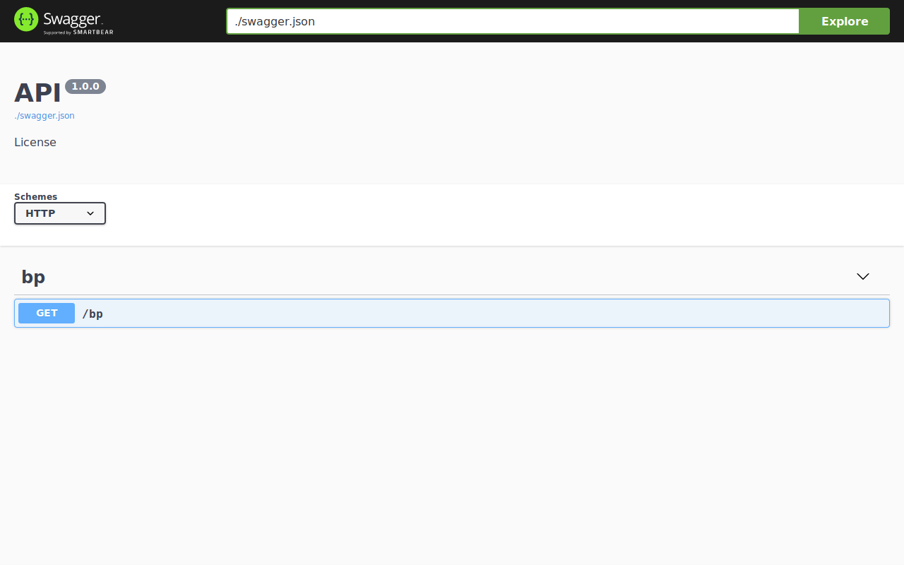
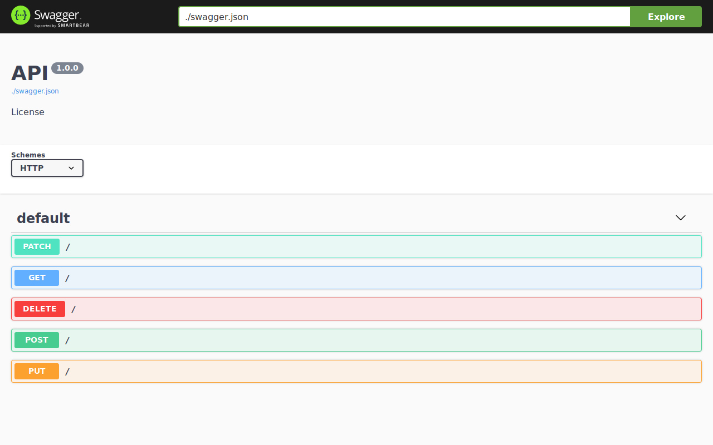
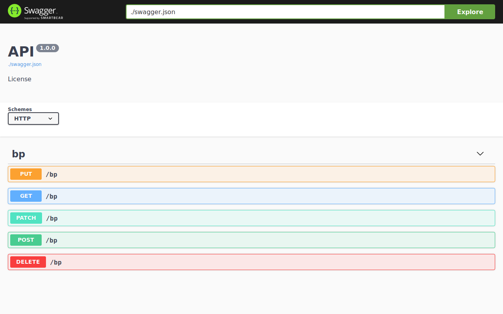

# Document Routes

Sanic-OpenAPI support different ways to document APIs includes:

* routes of `Sanic` instance
* routes of `Blueprint` instance
* routes of `HTTPMethodView` under `Sanic` instance
* routes of `HTTPMethodView` under `Bluebprint` instance

But with some exceptions:

* Sanic-OpenAPI does not document routes with `OPTIONS` method.
* Sanic-OpenAPI does not document routes which registered by `static()`.

This section will explain how to document routes with above cases.

## Basic Routes

To use Sanic-OpenAPI with basic routes, you only have to register `openapi2_blueprint` and it will be all set.

For example:

```python
from sanic import Sanic
from sanic.response import json

from sanic_openapi import openapi2_blueprint

app = Sanic()
app.blueprint(openapi2_blueprint)


@app.route("/")
async def test(request):
    return json({"hello": "world"})


if __name__ == "__main__":
    app.run(host="0.0.0.0", port=8000)

```

As you can see the result at <http://localhost:8000/swagger>, the Swagger is documented a route `/` with `GET` method.


If you want to add some additional information to this route, you can use other [decorators](decorators) like `summary()`, `description()`, and etc.

## Blueprint Routes

You can aldo document routes under any `Blueprint` like this:

```python
from sanic import Blueprint, Sanic
from sanic.response import json

from sanic_openapi import openapi2_blueprint

app = Sanic()
app.blueprint(openapi2_blueprint)

bp = Blueprint("bp", url_prefix="/bp")


@bp.route("/")
async def test(request):
    return json({"hello": "world"})


app.blueprint(bp)

if __name__ == "__main__":
    app.run(host="0.0.0.0", port=8000)

```

The result looks like:


When you document routes under `Blueprint` instance, they will be document with `tags` which using the `Blueprint`'s name.

## Class-Based Views Routes

In Sanic, it provides a class-based views named `HTTPMethodView`. You can document routes under `HTTPMethodView` like:

```python
from sanic import Sanic
from sanic.response import text
from sanic.views import HTTPMethodView

from sanic_openapi import openapi2_blueprint

app = Sanic()
app.blueprint(openapi2_blueprint)


class SimpleView(HTTPMethodView):
    def get(self, request):
        return text("I am get method")

    def post(self, request):
        return text("I am post method")

    def put(self, request):
        return text("I am put method")

    def patch(self, request):
        return text("I am patch method")

    def delete(self, request):
        return text("I am delete method")

    def options(self, request): # This will not be documented.
        return text("I am options method")


app.add_route(SimpleView.as_view(), "/")

if __name__ == "__main__":
    app.run(host="0.0.0.0", port=8000)

```

And the result:


Please note that Sanic-OpenAPI will not document any routes with `OPTIONS` method.

The `HTTPMethodView` can also be registered under `Blueprint`:

```python
from sanic import Blueprint, Sanic
from sanic.response import text
from sanic.views import HTTPMethodView

from sanic_openapi import openapi2_blueprint

app = Sanic()
app.blueprint(openapi2_blueprint)

bp = Blueprint("bp", url_prefix="/bp")


class SimpleView(HTTPMethodView):
    def get(self, request):
        return text("I am get method")

    def post(self, request):
        return text("I am post method")

    def put(self, request):
        return text("I am put method")

    def patch(self, request):
        return text("I am patch method")

    def delete(self, request):
        return text("I am delete method")

    def options(self, request):  # This will not be documented.
        return text("I am options method")


bp.add_route(SimpleView.as_view(), "/")
app.blueprint(bp)

if __name__ == "__main__":
    app.run(host="0.0.0.0", port=8000)

```

The result:

