# Fields

In Sanic-OpenAPI, there are lots of fields can be used to document your APIs. Those fields can represent different data type in your API request and response.

Currently, Sanic-OpenAPI provides following fileds:

* [Integer](#integer)
* [Float](#float)
* [String](#string)
* [Boolean](#boolean)
* [Tuple](#tuple)
* [Date](#date)
* [DateTime](#datetime)
* [File](#file)
* [Dictionary](#dictionary)
* [JsonBody](#jsonbody)
* [List](#list)
* [Object](#object)

## Integer

To document your API with integer data type, you can use `int` or `doc.Integer` with your handler function.
For example:

```python
from sanic import Sanic
from sanic.response import json

from sanic_openapi import doc, openapi2_blueprint

app = Sanic()
app.blueprint(openapi2_blueprint)


@app.get("/test")
@doc.consumes(doc.Integer(name="num"), location="query")
async def test(request):
    return json({"Hello": "World"})

```

And the swagger would be:
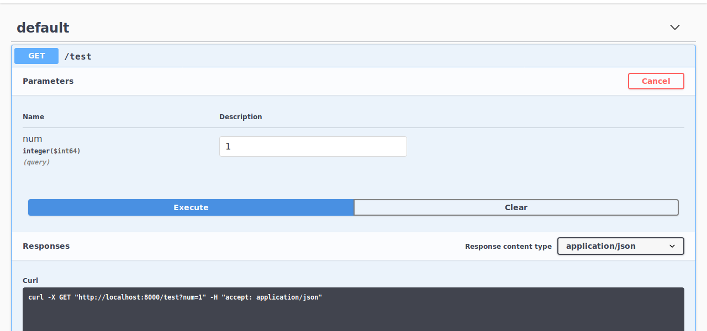

## Float

Using the `float` or `doc.Float` is quite similar with `doc.integer`:

```python
from sanic import Sanic
from sanic.response import json

from sanic_openapi import doc, openapi2_blueprint

app = Sanic()
app.blueprint(openapi2_blueprint)


@app.get("/test")
@doc.consumes(doc.Float(name="num"), location="query")
async def test(request):
    return json({"Hello": "World"})

```

The swagger:
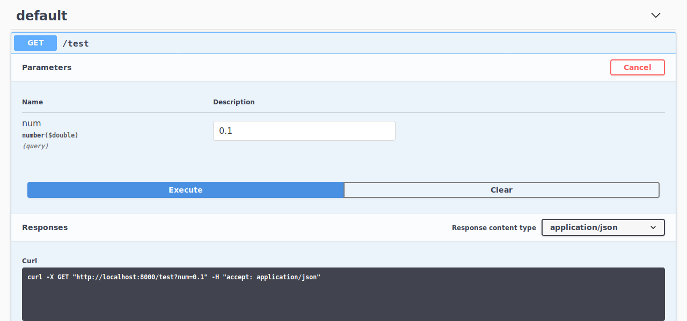

## String

The `doc.String` might be the most common filed in API documents. You can use it like this:

```python
from sanic import Sanic
from sanic.response import json

from sanic_openapi import doc, openapi2_blueprint

app = Sanic()
app.blueprint(openapi2_blueprint)


@app.get("/test")
@doc.consumes(doc.String(name="name"), location="query")
async def test(request):
    return json({"Hello": "World"})

```

The swagger will looks like:
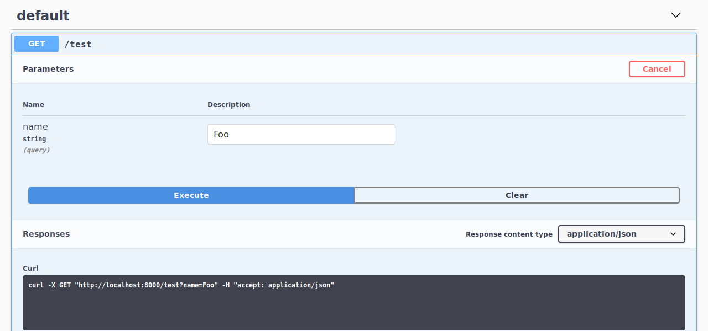

## Boolean

If you want to provide an `true` or `false` options in your API document, the `doc.Boolean` is what you need. When using `doc.Boolean` or `bool`, it wull be convert in to a dropdown list with `true` and `false` options in swagger.

For example:

```python
from sanic import Sanic
from sanic.response import json

from sanic_openapi import doc, openapi2_blueprint

app = Sanic()
app.blueprint(openapi2_blueprint)


@app.get("/test")
@doc.consumes(doc.Boolean(name="all"), location="query")
async def test(request):
    return json({"Hello": "World"})

```

The swagger will be:
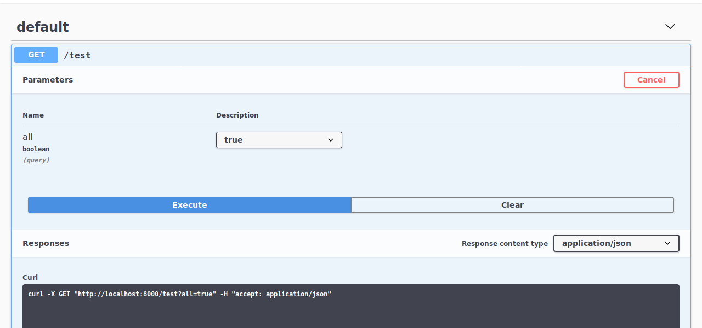

## Tuple

To be done.

## Date

To repersent the date data type, Sanic-OpenAPI also provides `doc.Date` to you. When you put `doc.Date` in `doc.produces()`, it will use the local date as value.

```python
from datetime import datetime

from sanic import Sanic
from sanic.response import json

from sanic_openapi import doc, openapi2_blueprint

app = Sanic()
app.blueprint(openapi2_blueprint)


@app.get("/test")
@doc.produces({"date": doc.Date()})
async def test(request):
    return json({"date": datetime.utcnow().date().isoformat()})

```

The example swagger:


## DateTime

Just like `doc.Date`, you can also use the `doc.DateTime` like this:

```python
from datetime import datetime

from sanic import Sanic
from sanic.response import json

from sanic_openapi import doc, openapi2_blueprint

app = Sanic()
app.blueprint(openapi2_blueprint)


@app.get("/test")
@doc.produces({"datetime": doc.DateTime()})
async def test(request):
    return json({"datetime": datetime.utcnow().isoformat()})

```

And the swagger:
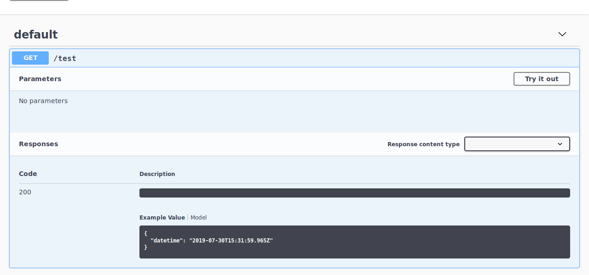

## File

Sanic-OpenAPI also support file field now. You can use this field to upload file through the swagger.
For example:

```python
from sanic import Sanic
from sanic.response import json

from sanic_openapi import doc, openapi2_blueprint

app = Sanic()
app.blueprint(openapi2_blueprint)


@app.post("/test")
@doc.consumes(
    doc.File(name="file"), location="formData", content_type="multipart/form-data"
)
@doc.produces({"size": doc.Integer(), "type": doc.String()})
async def test(request):
    file = request.files.get("file")
    size = len(file.body)
    return json({"size": size, "type": file.type})

```

And it would be a upload button on swagger:
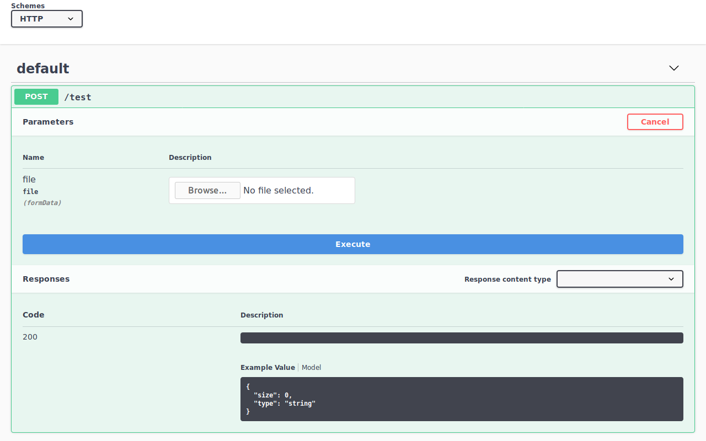

## Dictionary

To be done.

## JsonBody

To document you request or response body, the `doc.JsonBody` is the best choice. You can put a `dict` into `doc.JsonBody` like this:

```python
from sanic import Sanic
from sanic.response import json

from sanic_openapi import doc, openapi2_blueprint

app = Sanic()
app.blueprint(openapi2_blueprint)


@app.post("/test")
@doc.consumes(
    doc.JsonBody(
        {
            "useranme": doc.String("The name of your user account."),
            "password": doc.String("The password of your user account."),
        }
    ),
    location="body",
)
async def test(request):
    return json({})

```

And it will convert to:
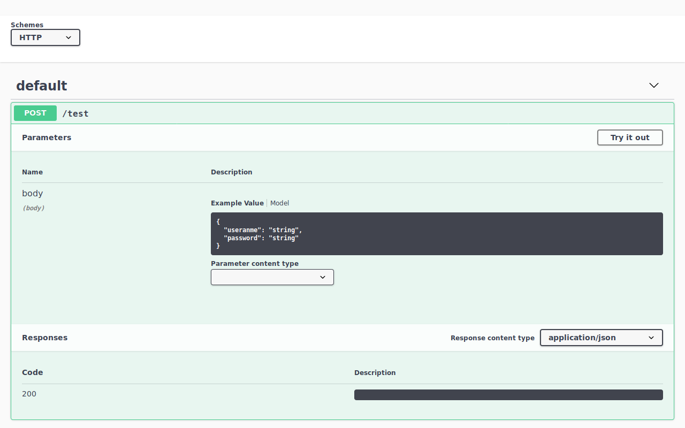

```eval_rst
.. note:: The `doc.JsonBody` only support `dict` input. If you want to put a python `class` in body, please use `doc.Object`.
```

## List

When design a RESTful with list resources API, the `doc.List` can help you document this API.

For example:

```python
from sanic import Sanic
from sanic.response import json

from sanic_openapi import doc, openapi2_blueprint

app = Sanic()
app.blueprint(openapi2_blueprint)


class User:
    username = doc.String("The name of your user account.")
    password = doc.String("The password of your user account.")


@app.get("/test")
@doc.produces(doc.List(User))
async def test(request):
    return json([])

```

The swagger will be:
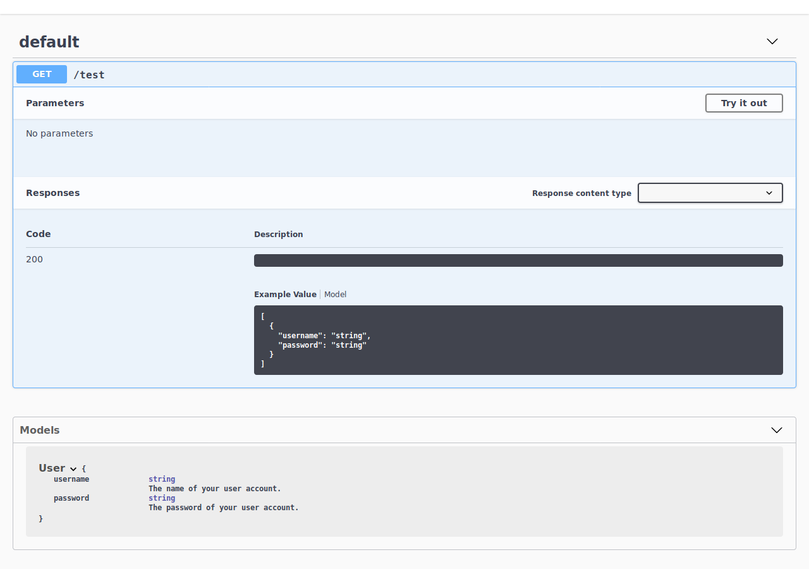

```eval_rst
.. note:: When using a Python `class` to model your data, Sanic-OpenAPI will put it at model definitions.
```

## Object

In Sanic-OpenAPI, you can document your data as a Python `class` and it wil be convert to `doc.Object` automaticlly. After the conversion, you can find your model definitions at the bottom of swagger.

```python
from sanic import Sanic
from sanic.response import json

from sanic_openapi import doc, openapi2_blueprint

app = Sanic()
app.blueprint(openapi2_blueprint)


class User:
    username = doc.String("The name of your user account.")
    password = doc.String("The password of your user account.")


@app.get("/test")
@doc.produces(User)
async def test(request):
    return json({})

```

And the result:
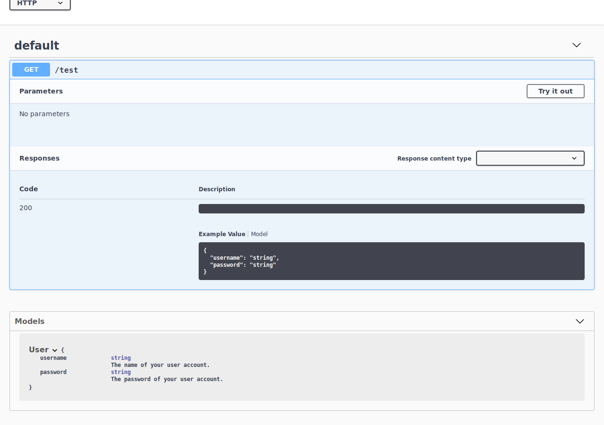

Inheritance is also supported.

```python
from sanic import Sanic
from sanic.response import json

from sanic_openapi import doc, openapi2_blueprint

app = Sanic()
app.blueprint(openapi2_blueprint)


class User:
    username = doc.String("The name of your user account.")
    password = doc.String("The password of your user account.")


class UserInfo(User):
    first_name = doc.String("The first name of user.")
    last_name = doc.String("The last name of user.")


@app.get("/test")
@doc.produces(UserInfo)
async def test(request):
    return json({})

app.run(host="0.0.0.0", debug=True)

```

And the result:
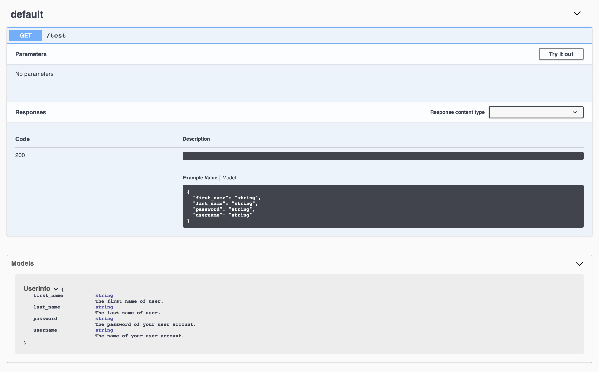

## [PEP484](https://www.python.org/dev/peps/pep-0484/)'s type hinting

Provisional support, as discussed at [#128](../../../../issues/128)
```python
from typing import List

from sanic import Sanic
from sanic.response import json

from sanic_openapi import doc, openapi2_blueprint

app = Sanic()
app.blueprint(openapi2_blueprint)


class Car:
    make: str
    model: str
    year: int

class Garage:
    cars: List[Car]


@app.get("/garage")
@doc.summary("Lists cars in a garage")
@doc.produces(Garage)
async def get_garage(request):
    return json([{
                 "make": "Nissan",
                 "model": "370Z",
                 "year": "2006",
    }])
```

And the result:
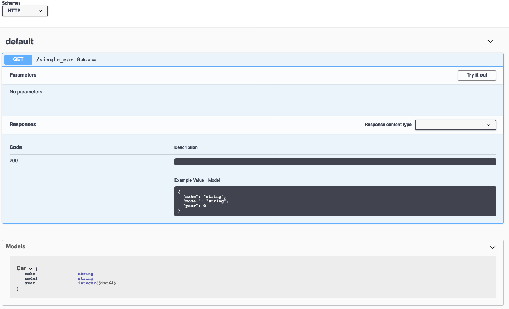

[TypedDicts](https://www.python.org/dev/peps/pep-0589/) are also supported. In the previous example, `Car` could be defined as:

```python
class Car(TypedDict):
    make: str
    model: str
    year: int
```


## Descriptive Field

As the object example, you can use python class to document your request or response body. To make it more descriptive, you can add the descriptoin to every fields if you need. For example:

```python
from sanic import Sanic
from sanic.response import json

from sanic_openapi import doc, openapi2_blueprint

app = Sanic()
app.blueprint(openapi2_blueprint)


class Car:
    make = doc.String("Who made the car")
    model = doc.String("Type of car.  This will vary by make")
    year = doc.Integer("4-digit year of the car", required=False)

class Garage:
    spaces = doc.Integer("How many cars can fit in the garage")
    cars = doc.List(Car, description="All cars in the garage")

@app.get("/test")
@doc.produces(Garage)
async def test(request):
    return json({})


```

And you can get this model definitions on swagger:

