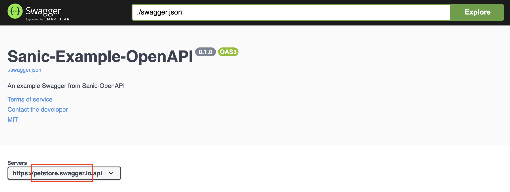
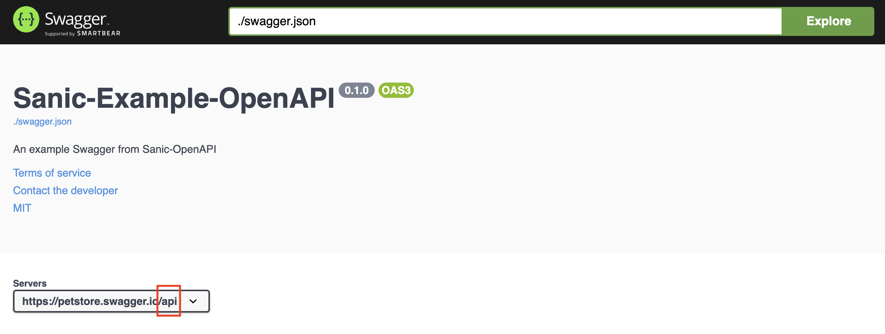
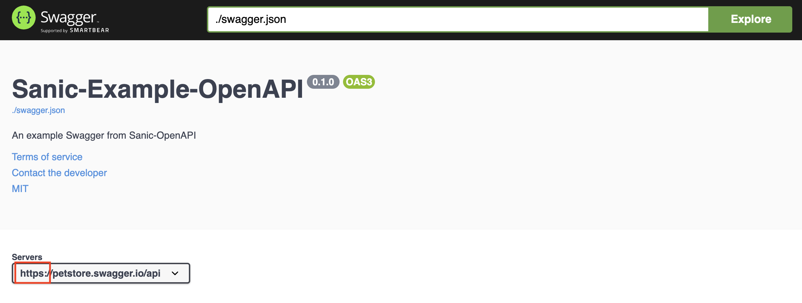
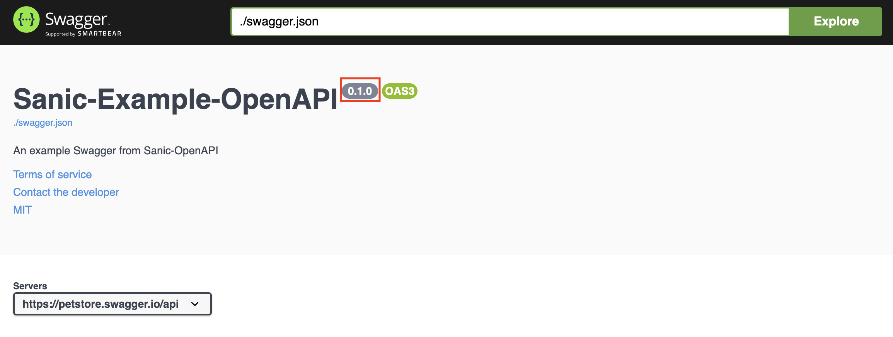
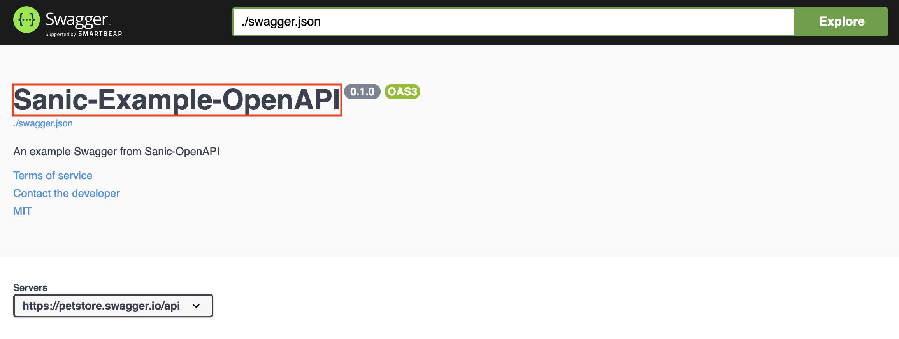
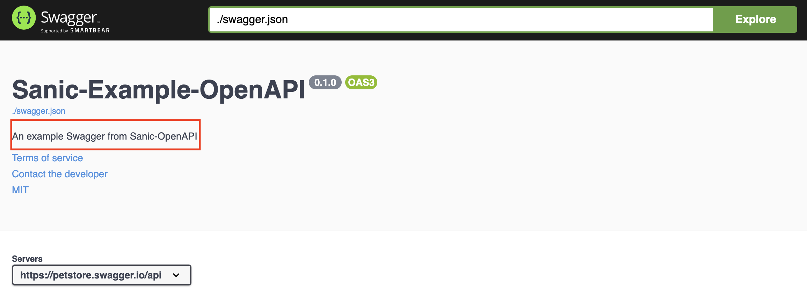
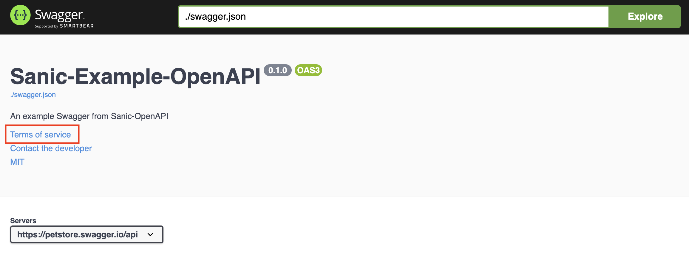
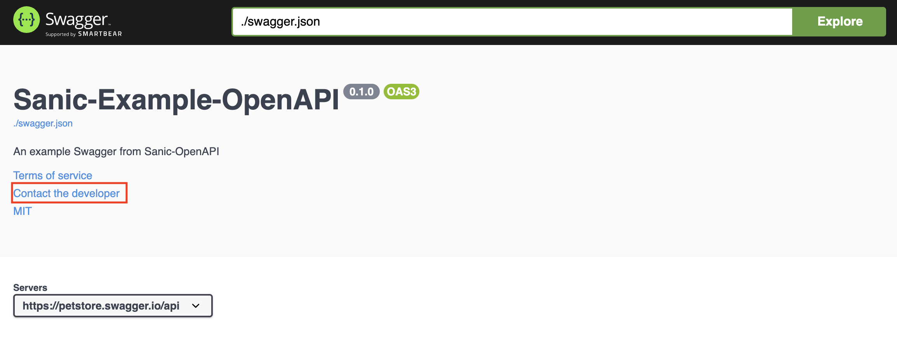
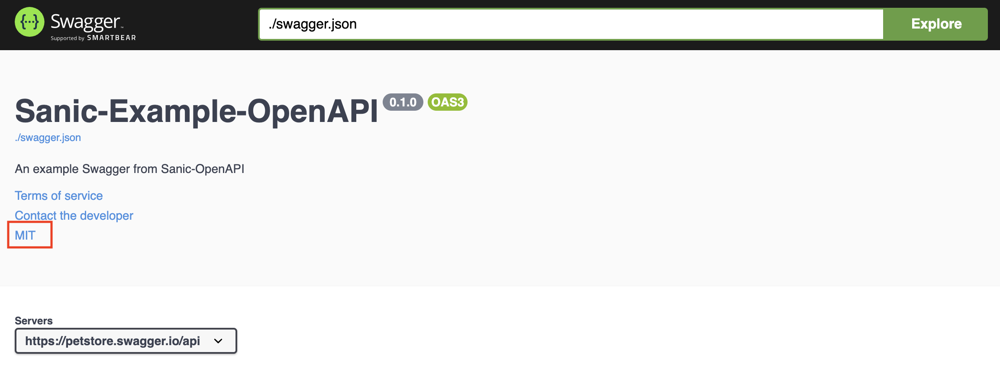

# Configurations

Sanic-OpenAPI provides following configurable items:

* API Server
* API information
* Authentication(Security Definitions)
* URI filter
* Swagger UI configurations

## API Server

By default, Swagger will use exactly the same host which served itself as the API server. But you can still override this by setting following configurations. For more information, please check document at [here](https://swagger.io/docs/specification/2-0/api-host-and-base-path/).

### API_HOST

* Key: `API_HOST`
* Type: `str` of IP, or hostname
* Default: `None`
* Usage:

    ```python
    from sanic import Sanic
    from sanic_openapi import openapi3_blueprint

    app = Sanic()
    app.blueprint(openapi3_blueprint)
    app.config.API_HOST = "petstore.swagger.io"

    ```

* Result:
  

### API_BASEPATH

* Key: `API_BASEPATH`
* Type: `str`
* Default: `None`
* Usage:

    ```python
    from sanic import Sanic
    from sanic_openapi import openapi3_blueprint

    app = Sanic()
    app.blueprint(openapi3_blueprint)
    app.config.API_BASEPATH = "/api"

    ```

* Result:
  

### API_SCHEMES

* Key: `API_SCHEMES`
* Type: `list` of schemes
* Default: `["http"]`
* Usage:

    ```python
    from sanic import Sanic
    from sanic_openapi import openapi3_blueprint

    app = Sanic()
    app.blueprint(openapi3_blueprint)
    app.config.API_SCHEMES = ["https"]

    ```

* Result:
  

## API information

You can provide some additional information of your APIs by using Sanic-OpenAPI configurations.
For more detail of those additional information, please check the [document](https://swagger.io/specification/#infoObject) from Swagger.

### API_VERSION

* Key: `API_VERSION`
* Type: `str`
* Default: `1.0.0`
* Usage:

    ```python
    from sanic import Sanic
    from sanic_openapi import openapi3_blueprint

    app = Sanic()
    app.blueprint(openapi3_blueprint)
    app.config.API_VERSION = "0.1.0"

    ```

* Result:
  

### API_TITLE

* Key: `API_TITLE`
* Type: `str`
* Default: `API`
* Usage:

    ```python
    from sanic import Sanic
    from sanic_openapi import openapi3_blueprint

    app = Sanic()
    app.blueprint(openapi3_blueprint)
    app.config.API_TITLE = "Sanic-Example-OpenAPI"

    ```

* Result:
  

### API_DESCRIPTION

* Key: `API_DESCRIPTION`
* Type: `str`
* Deafult: `""`
* Usage:

    ```python
    from sanic import Sanic
    from sanic_openapi import openapi3_blueprint

    app = Sanic()
    app.blueprint(openapi3_blueprint)
    app.config.API_DESCRIPTION = "An example Swagger from Sanic-OpenAPI"

    ```

* Result:
  

### API_TERMS_OF_SERVICE

* Key: `API_TERMS_OF_SERVICE`
* Type: `str` of a URL
* Deafult: `""`
* Usage:

  ```python
    from sanic import Sanic
    from sanic_openapi import openapi3_blueprint

    app = Sanic()
    app.blueprint(openapi3_blueprint)
    app.config.API_TERMS_OF_SERVICE = "https://github.com/sanic-org/sanic-openapi/blob/master/README.md"

  ```

* Result:
  

### API_CONTACT_EMAIL

* Key: `API_CONTACT_EMAIL`
* Type: `str` of email address
* Deafult: `None"`
* Usage:

    ```python
    from sanic import Sanic
    from sanic_openapi import openapi3_blueprint

    app = Sanic()
    app.blueprint(openapi3_blueprint)
    app.config.API_CONTACT_EMAIL = "foo@bar.com"

    ```

* Result:
  

### API_LICENSE_NAME

* Key: `API_LICENSE_NAME`
* Type: `str`
* Default: `None`
* Usage:

    python
    from sanic import Sanic
    from sanic_openapi import openapi3_blueprint

    app = Sanic()
    app.blueprint(openapi3_blueprint)
    app.config.API_LICENSE_NAME = "MIT"

    

* Result:
  

### API_LICENSE_URL

* Key: `API_LICENSE_URL`
* Type: `str` of URL
* Default: `None`
* Usgae:

    ```python
    from sanic import Sanic
    from sanic_openapi import openapi3_blueprint

    app = Sanic()
    app.blueprint(openapi3_blueprint)
    app.config.API_LICENSE_URL = "https://github.com/sanic-org/sanic-openapi/blob/master/LICENSE"

    ```

* Result:
  
