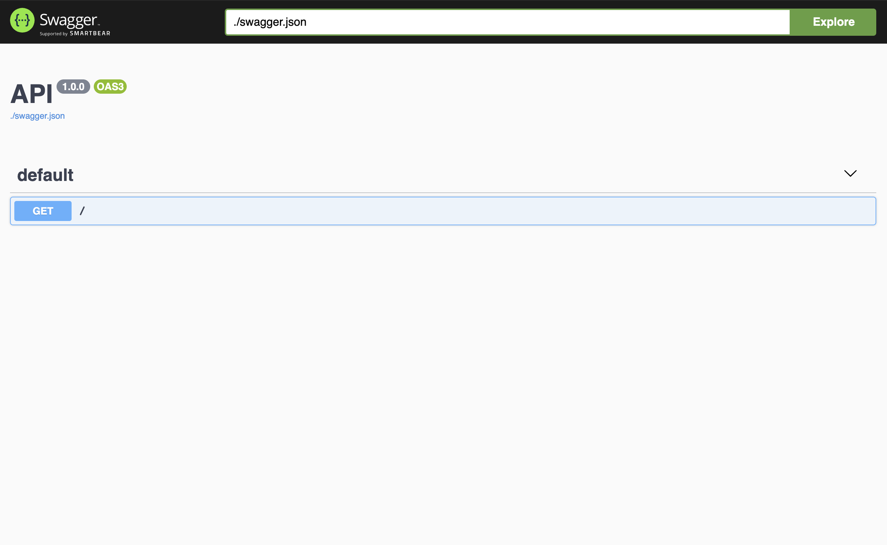

# Sanic OpenAPI 3

⚠️ Sanic OpenAPI 3 support is experimental. This feature may be subject to change in future releases.

## Getting started

Here is an example to use Sanic-OpenAPI 2:

```python
from sanic import Sanic
from sanic.response import json

from sanic_openapi import openapi3_blueprint

app = Sanic("Hello world")
app.blueprint(openapi3_blueprint)


@app.route("/")
async def test(request):
    return json({"hello": "world"})


if __name__ == "__main__":
    app.run(host="0.0.0.0", port=8000)
```

And you can get your Swagger document at <http://localhost:8000/swagger> like this:


## Contents

* [Document Routes](/sanic_openapi3/document_routes)
* [Configurations](/sanic_openapi3/configurations)
* [Decorators](/sanic_openapi3/decorators)
* [Examples](/sanic_openapi3/examples)
