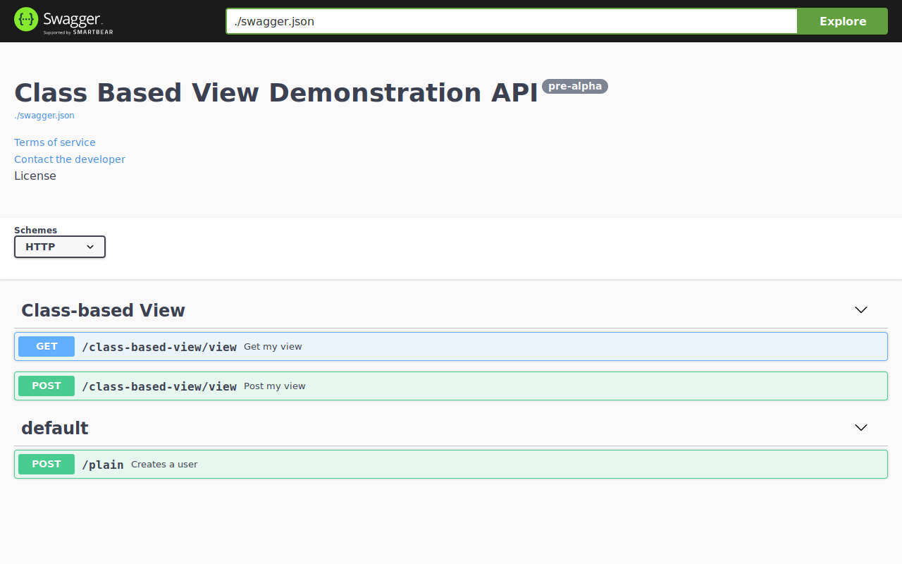

## Class Based View

[Source](https://github.com/sanic-org/sanic-openapi/tree/master/examples/class_based_view)

This example shows how to use Sanic-OpenAPI with Sanic's Class based view with Sanic-OpenAPI's decorators.

To run this example, please make sure you have already install `sanic` and `sanic-openapi`.
Or, run the install command:

```shell
pip install sanic sanic-openapi
```

And, you can run this example by:

```shell
python main.py
```

Now, check <http://localhost:8000/swagger> and you should see the swagger like:

